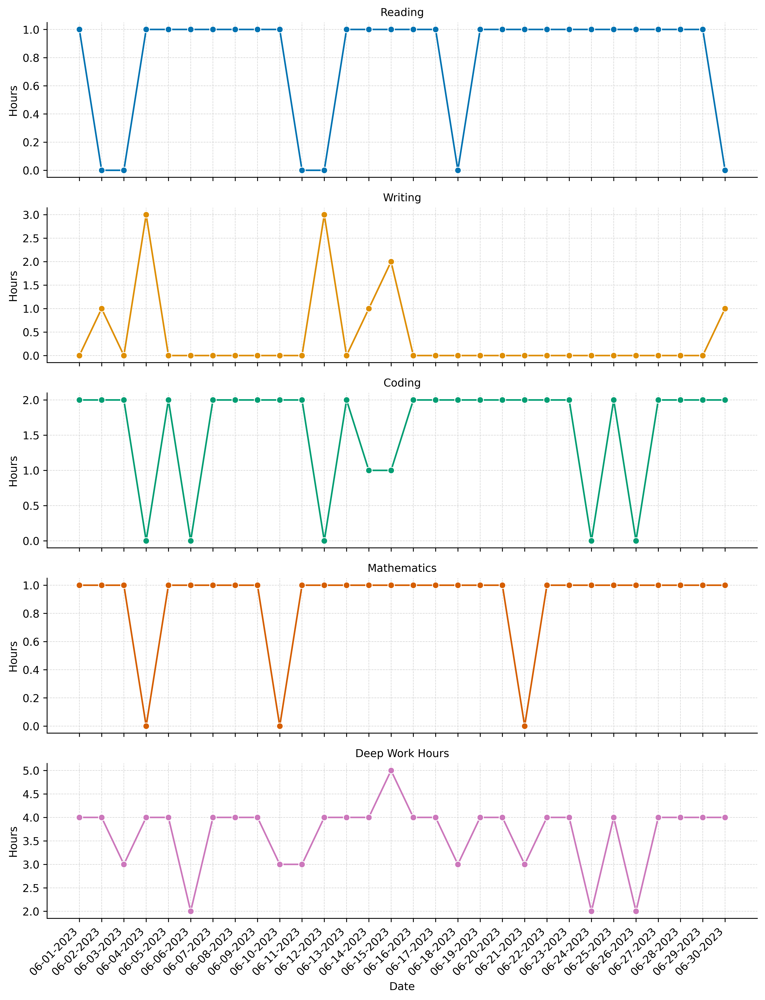

# Deep Work Tracker

Deep Work Tracker is a productivity tool designed to help you track a state of peak concentration known as deep work. By incorporating deep work into your workflow, you can learn hard things and create high-quality work efficiently. This repository provides a simple solution for tracking your daily results. 

## Table of Contents
  - [Installation](#installation)
  - [Dependencies](#dependencies)
  - [Usage](#usage)
  - [Contributing](#contributing)
  - [License](#license)
  - [Acknowledgments](#acknowledgments)

## Installation

You can install this project by cloning the repository, forking the repository, or downloading the zip files.

To **clone** the repository, open a terminal and run the following command:

```sh
git clone git@github.com:your-username/deep_work_tracker.git
```

Make sure to replace `your-username` with your GitHub username.

To **fork** the repository, click on the `Fork` button in the top-right corner of this page. This will create a copy of the repository in your GitHub account.

To **download** the zip files, click on the `Code` button in the top-right corner of this page and then click on `Download ZIP`. Extract the zip files to a directory of your choice

## Dependencies

- Pandas
- Matplotlib
- Seaborn 

## Usage

1. Install the dependencies using pip:

```
pip install pandas matplotlib seaborn
```

2. Duplicate the `MONTH_YEAR` directory, making sure to replace MONTH and YEAR with the appropriate month and year for which you want to track your deep work hours. 

3. Edit the `table.csv` file located in your duplicated `MONTH_YEAR` directory. For clarification purposes, we will use the `table.csv` file in the default `MONTH_YEAR` directory:

```
Date,Reading,Writing,Coding,Mathematics
06-01-2023,1,0,2,1
06-02-2023,0,1,2,1
06-03-2023,0,0,2,1
06-04-2023,1,3,0,0
...
```

_Note: a date in the “Date” column should be in the format `MM-DD-YYYY`._

4. In your `MONTH_YEAR` directory, run the following script:

```
python update_monthly_summary.py
```

Three files will be generated in your `MONTH_YEAR` directory:

- `monthly_summary.md`
- `figures/monthly_breakdown.png`
- `figures/daily_breakdown.png`

For the default `MONTH_YEAR` directory above, `monthly_summary.md` will contain `monthly_breakdown.png`, which will look like this:


And `daily_breakdown.png`, which will look like this:




## Contributing

Pull requests are welcome. For major changes, please open an issue first to discuss what you'd like to change.

## License

[MIT](https://choosealicense.com/licenses/mit/)


## Acknowledgments
This project is inspired by the principles and concepts introduced by Cal Newport in his book [Deep Work: Rules for Focused Success in a Distracted World](https://www.amazon.com/Deep-Work-Focused-Success-Distracted/dp/1455586692). We would like to express our gratitude to Cal Newport for his insightful work and for highlighting the importance of deep work in producing quality results. 